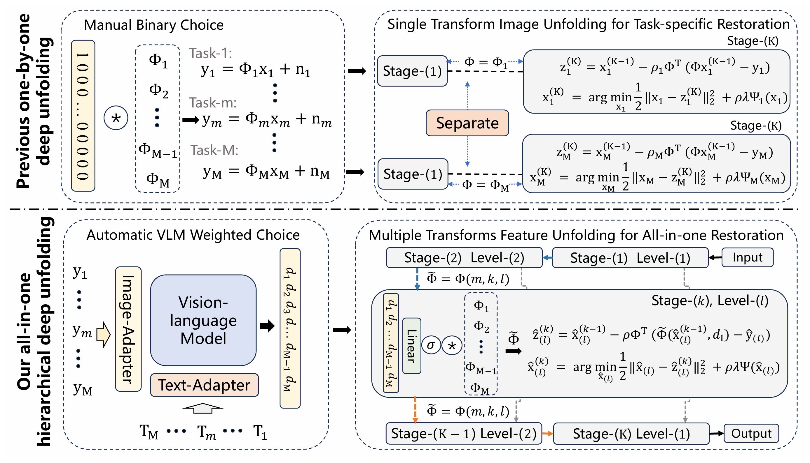
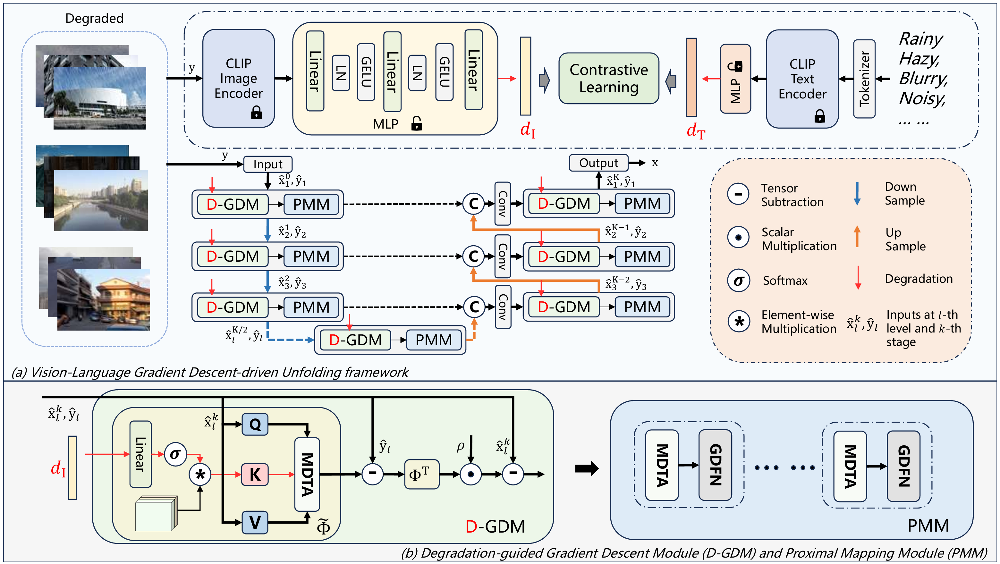
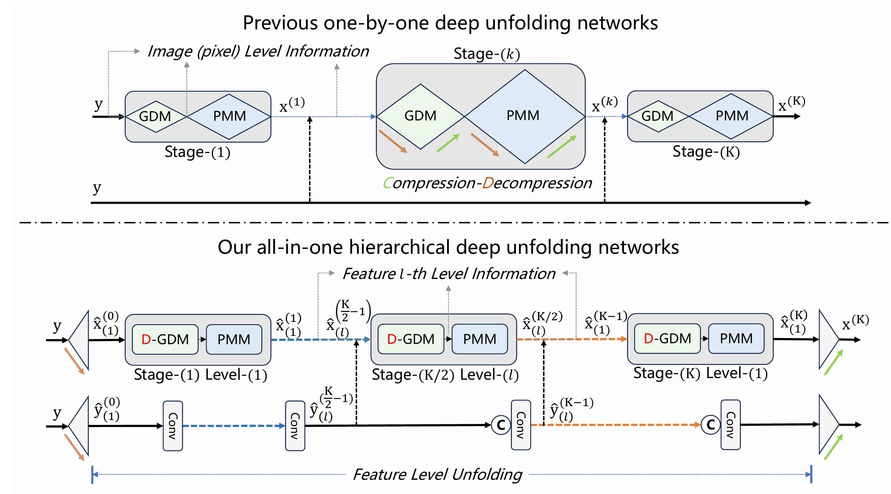
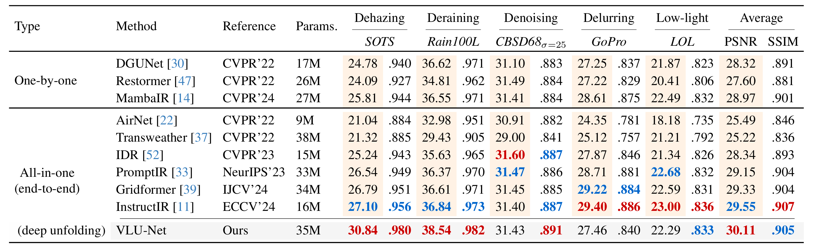
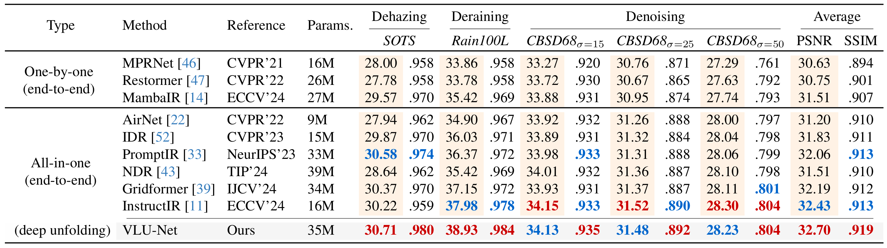
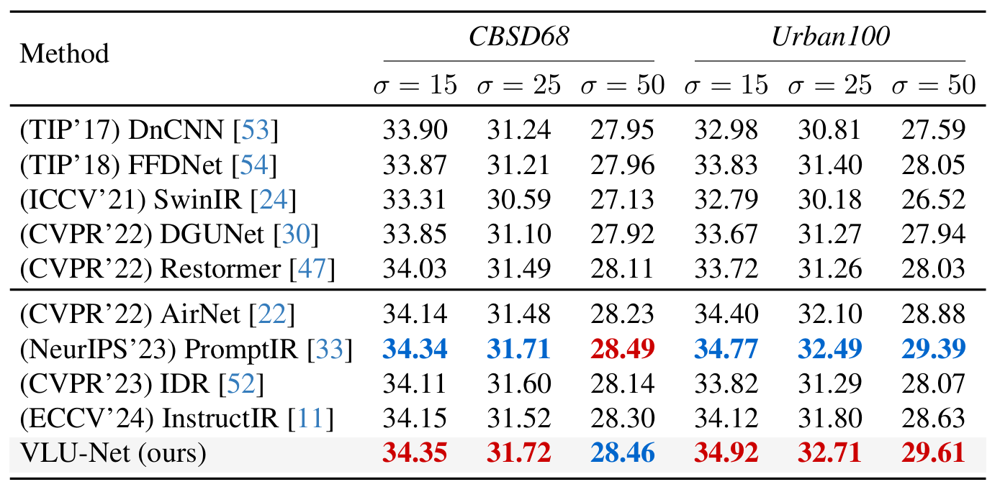
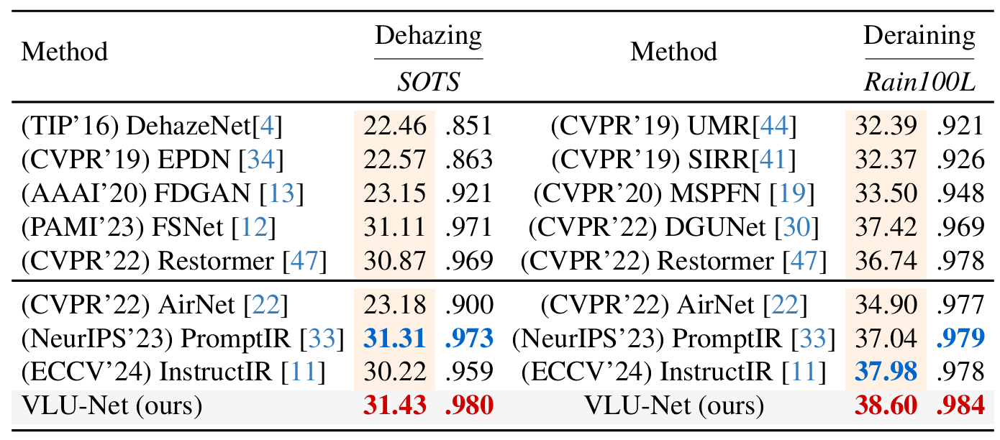

# Vision-Language Gradient Descent-driven All-in-One Deep Unfolding Networks</span><br>
[](https://arxiv.org/pdf/2503.16930)


Contact: xmwang28@gmail.com

---
**Abstract:** Dynamic image degradations, including noise, blur and lighting inconsistencies, pose significant challenges in image restoration, often due to sensor limitations or adverse environmental conditions. 
Existing Deep Unfolding Networks (DUNs) offer stable restoration performance but require manual selection of degradation matrices for each degradation type, limiting their adaptability across diverse scenarios.
To address this issue, we propose the Vision-Language-guided Unfolding Network (VLU-Net), a unified DUN framework for handling multiple degradation types simultaneously.
VLU-Net leverages a Vision-Language Model (VLM) refined on degraded image-text pairs to align image features with degradation descriptions, selecting the appropriate transform for target degradation.
By integrating an automatic VLM-based gradient estimation strategy into the Proximal Gradient Descent (PGD) algorithm, VLU-Net effectively tackles complex multi-degradation restoration tasks while maintaining interpretability. 
Furthermore, we design a hierarchical feature unfolding structure to enhance VLU-Net framework, efficiently synthesizing degradation patterns across various levels.
VLU-Net is the first all-in-one DUN framework and outperforms current leading one-by-one and all-in-one end-to-end methods by 3.74 dB on the SOTS dehazing dataset and 1.70 dB on the Rain100L deraining dataset.

<p align="center">
    
</p>


### • Framework
<p align="center">
    
</p>

### • Framework comparison
<p align="center">
    
</p>

## 📧 News
- **February 26, 2025:** Our work has been accepted by CVPR 2025, codes and results are coming soon!
- **March 24, 2025:** We release the three-task, five-task and single restoration results, also the paper in Arxiv: https://arxiv.org/pdf/2503.16930.
- **May 23, 2025:** We release the codes.

## 🔗 Contents
- [x] [Installation](#environment-installation)
- [x] [Training](#training)
- [x] [Testing](#testing)
- [x] [Citation](#citation)
- [x] [Results](#Results)


<h2 id="environment-installation">🔨 Environment Installation</h2>

**1️⃣**
Make conda environment

```shell
git clone https://github.com/xianggkl/VLU-Net.git

cd VLU-Net

conda create -n vlunet

conda activate vlunet

pip install -r requirements.txt
```

**2️⃣**
Download the weights from link: https://drive.google.com/file/d/1214SfTO5LDMr3Ck_aVVUuZhuqhteMJ7P/view?usp=sharing, and put it as ./pretrained_ckpt.

**3️⃣**
Download the datasets from the websites, and put it as ./datasets to be processed by VLU-Net/utils/dataset_utils_clip.py.

**Option**
You can download the results below:

For one-by-one IR results

https://drive.google.com/file/d/1Xbq3g15SYGCisPA2TZsx_WEUzhC7MCjL/view?usp=sharing

For all-in-one IR results

NHRBL (five-task): https://drive.google.com/file/d/1vR7PrXGCJTZcAwWQePihcEuozvc8Ggpt/view?usp=sharing

NHR (three-task): https://drive.google.com/file/d/1p9yP80KXmK7kk_6cTINdbqFfrrCcyrZt/view?usp=sharing


<h2 id="training">🏋️ Training</h2>

Change the parameters for free to suit your training.
```shell
python train.py --name Final5 --de_dim 7 --de_type ['denoise_15', 'denoise_25', 'denoise_50', 'derain', 'dehaze', 'delowlight', 'deblur']
```

<h2 id="testing">⚡ Testing</h2>

Set your test datasets paths in the code test.py and run
```shell
python test.py --name final_results --task NHR --de_dim 7 --pretrained_ckpt_path "./pretrained_ckpt/3task_vlunet.ckpt"
python test.py --name final_results --task NHRBL --de_dim 7 --pretrained_ckpt_path "./pretrained_ckpt/5task_vlunet.ckpt"
python test.py --name final_results --task N --de_dim 7 --pretrained_ckpt_path "./pretrained_ckpt/single_noise_vlunet.ckpt"
python test.py --name final_results --task H --de_dim 5 --pretrained_ckpt_path "./pretrained_ckpt/single_haze_vlunet.ckpt"
python test.py --name final_results --task R --de_dim 5 --pretrained_ckpt_path "./pretrained_ckpt/singel_rain_vlunet.ckpt"
python test.py --name final_results --task B --de_dim 5 --pretrained_ckpt_path "./pretrained_ckpt/single_blur_vlunet.ckpt"
python test.py --name final_results --task L --de_dim 5 --pretrained_ckpt_path "./pretrained_ckpt/single_lowlight_vlunet.ckpt"
```

<h2 id="citation">🎓 Citation</h2>
If you find this repository helpful to your research, please consider citing the following:

```
@inproceedings{vlunet2025,
  title={Vision-Language Gradient Descent-driven All-in-One Deep Unfolding Networks},
  author={Zeng, Haijin and Wang, Xiangming and Chen, Yongyong and Su, Jingyong and Liu, Jie},
  booktitle={Proceedings of the IEEE/CVF Conference on Computer Vision and Pattern Recognition},
  year={2025}
}
```

or

```
@article{vlunet2025,
  title={Vision-Language Gradient Descent-driven All-in-One Deep Unfolding Networks},
  author={Zeng, Haijin and Wang, Xiangming and Chen, Yongyong and Su, Jingyong and Liu, Jie},
  journal={arXiv preprint arXiv:2503.16930},
  year={2025}
}
```

<h2 id="results">⚡ Results</h2>

<p align="center">
    
</p>

<p align="center">
    
</p>

<p align="center">
    
</p>

<p align="center">
    
</p>

<p align="center">
    
</p>

<h2 id="acknowledgement"> 🤗 Acknowledgement</h2>

This work is based on [Restormer](https://github.com/swz30/Restormer), [DGUNet](https://github.com/MC-E/Deep-Generalized-Unfolding-Networks-for-Image-Restoration), [open_clip](https://github.com/mlfoundations/open_clip). Thanks for their outstanding work.